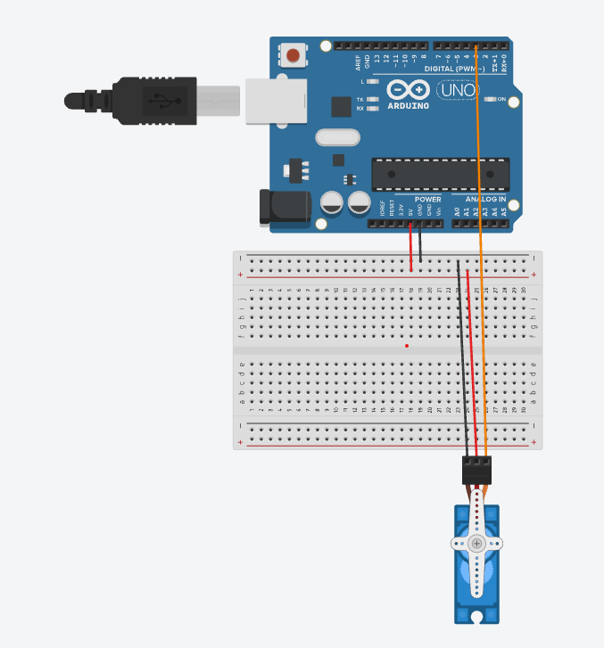

Automatic Servo Motor Sweep using Arduino

The Automatic Servo Motor Sweep using Arduino project demonstrates the automatic movement of a servo motor through a sequence of predefined angles. The Arduino Uno controls the servo motor by rotating it from 0° to 180° in steps of 30° with a fixed time delay. At each position, the current servo angle is displayed on the Serial Monitor. This project introduces the concepts of servo motor control, PWM signals, looping structures, and serial communication.

---

Hardware Required

- Arduino Uno
- SG90 Servo Motor (or equivalent)
- Breadboard (Optional)
- Jumper Wires
- USB Cable
- Computer/Laptop

---

Software Required

- Arduino IDE
- Servo Library (Built into Arduino IDE)

---

Theory

Arduino Uno

The Arduino Uno is an open-source microcontroller board based on the ATmega328P. It is widely used for robotics, embedded systems, and automation projects. The Arduino controls the servo motor by generating PWM control signals.

---

Arduino IDE

The Arduino IDE is the software used to write, compile, and upload programs to Arduino boards. It also provides the Serial Monitor for observing program output during execution.

---

Servo Motor

A servo motor is a rotary actuator capable of precise angular positioning. It receives PWM control signals from the Arduino and rotates to the specified angle, typically between 0° and 180°.

---

Servo Library

The Servo library provides simple functions to control servo motors. The "attach()" function connects the servo to a digital pin, while the "write()" function rotates the servo to a specified angle.

---

Serial Monitor

The Serial Monitor displays the servo angle after every movement, allowing users to monitor the operation of the program in real time.

---

Circuit Connections

| Arduino Uno Pin | Component |
|-----------------|-----------|
| Pin 3 | Servo Motor Signal (Orange/Yellow Wire) |
| 5V | Servo Motor VCC (Red Wire) |
| GND | Servo Motor GND (Brown/Black Wire) |

---

Circuit Diagram

---

Program

The complete Arduino source code is available in the "Automatic-Servo-Motor-Sweep.ino" file.

---

Working Principle

Initially, the servo motor is positioned at 180°. The Arduino then executes a "for" loop that gradually changes the servo angle from 0° to 180° in increments of 30°. After each movement, the servo pauses for 500 milliseconds, and the current angle is displayed on the Serial Monitor. Once the servo reaches 180°, the loop repeats continuously, producing a smooth automatic sweeping motion.

---

Procedure

1. Connect the servo motor to the Arduino Uno according to the circuit connections.
2. Connect the Arduino to the computer using a USB cable.
3. Open the Arduino IDE.
4. Write or open the program.
5. Select the correct Arduino board and COM port.
6. Upload the program to the Arduino Uno.
7. Open the Serial Monitor and set the baud rate to 9600.
8. Observe the servo motor rotating automatically through the predefined angles while the current angle is displayed on the Serial Monitor.

---

Expected Outcome

- The servo motor automatically rotates from 0° to 180° in 30° increments.
- The servo pauses briefly at each position.
- The current servo angle is displayed on the Serial Monitor.
- The movement repeats continuously without requiring user input.

---