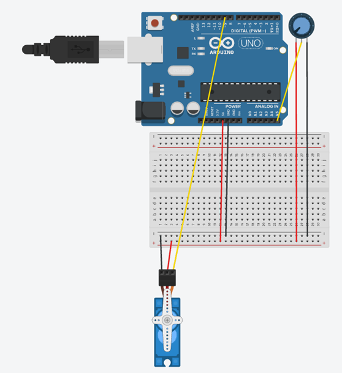

Servo Motor Control using Potentiometer

This project demonstrates how to control the angular position of a servo motor using a potentiometer with an Arduino Uno. The Arduino continuously reads the analog value from the potentiometer, maps it to an angle between 0° and 180°, and rotates the servo motor accordingly. The potentiometer value and corresponding servo angle are displayed on the Serial Monitor for real-time monitoring.

---

Hardware Required

- Arduino Uno
- Servo Motor (SG90 or equivalent)
- Potentiometer (10 kΩ)
- Breadboard
- Jumper Wires
- USB Cable

---

Software Required

- Arduino IDE
- Servo Library (Built into Arduino IDE)

---

Theory

Arduino Uno

The Arduino Uno is an open-source microcontroller board used for developing embedded systems, robotics, and automation projects. It reads sensor inputs, processes data, and controls output devices.

---

Arduino IDE

The Arduino IDE is used to write, compile, and upload Arduino sketches. It also includes the Serial Monitor for displaying program output and debugging.

---

Servo Motor

A servo motor is a rotary actuator capable of precise angular movement. Unlike a standard DC motor, it rotates to a specified angle, usually between 0° and 180°, based on control signals from the Arduino.

---

Potentiometer

A potentiometer is a variable resistor that provides an analog voltage output. Rotating its knob changes the resistance, producing a voltage that the Arduino reads as an analog value between 0 and 1023.

---

Serial Monitor

The Serial Monitor displays the potentiometer reading and the corresponding servo angle, making it easier to observe how the servo responds to changes in the potentiometer.

---

Circuit Connections

| Arduino Uno Pin | Component |
|-----------------|-----------|
| Pin 9 | Servo Motor Signal (Orange/Yellow Wire) |
| 5V | Servo Motor VCC (Red Wire) |
| GND | Servo Motor GND (Brown/Black Wire) |
| A5 | Potentiometer Middle Pin (Wiper) |
| 5V | Potentiometer Outer Pin |
| GND | Potentiometer Other Outer Pin |

---

Circuit Diagram

---

Program

The complete Arduino source code is available in the "Servo-Motor-Control-using-Potentiometer.ino" file.

---

Working Principle

The Arduino continuously reads the analog voltage from the potentiometer connected to pin A5. The "map()" function converts this value from the range 0–1023 into a servo angle of 0°–180°. The servo motor then rotates to the calculated angle. The potentiometer value and servo angle are simultaneously displayed on the Serial Monitor.

---

Procedure

1. Connect the servo motor and potentiometer according to the circuit connections.
2. Open the Arduino IDE.
3. Write or open the program.
4. Select the correct Arduino board and COM port.
5. Upload the program to the Arduino Uno.
6. Open the Serial Monitor and set the baud rate to 9600.
7. Rotate the potentiometer knob and observe the servo motor movement and Serial Monitor output.

---

Expected Outcome

- Rotating the potentiometer changes the servo motor angle smoothly from 0° to 180°.
- The Serial Monitor displays the potentiometer value and corresponding servo angle in real time.

---
