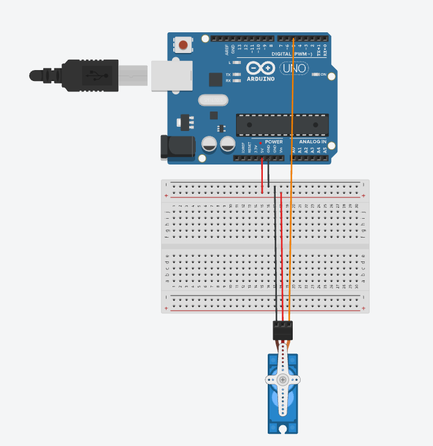

Servo Motor Control using Serial Monitor

The Servo Motor Control using Serial Monitor project demonstrates how to control the angular position of a servo motor using serial communication with an Arduino Uno. Instead of using physical input devices such as a potentiometer, the user enters the desired angle through the Arduino IDE's Serial Monitor. The Arduino processes the entered value, validates the input, and rotates the servo motor to the specified position. This project introduces the concepts of serial communication, user input processing, and precise servo motor control.

---

Hardware Required

- Arduino Uno
- SG90 Servo Motor (or equivalent)
- Breadboard (Optional)
- Jumper Wires
- USB Cable
- Computer/Laptop

---

Software Required

- Arduino IDE
- Servo Library (Built into Arduino IDE)

---

Theory

Arduino Uno

The Arduino Uno is an open-source microcontroller board based on the ATmega328P. It is widely used for embedded systems, robotics, automation, and electronic prototyping. It receives user input, processes data, and controls connected devices.

---

Arduino IDE

The Arduino Integrated Development Environment (IDE) is the software used to write, compile, and upload programs to Arduino boards. It also provides tools such as the Serial Monitor, Serial Plotter, and Library Manager for project development and debugging.

---

Servo Motor

A servo motor is a rotary actuator capable of moving to a precise angular position. It receives Pulse Width Modulation (PWM) signals from the Arduino, allowing it to rotate accurately between 0° and 180°.

---

Servo Library

The Servo library simplifies servo motor control by providing functions such as "attach()" to connect the servo to a digital pin and "write()" to rotate the servo to a specified angle.

---

Serial Communication

Serial communication is a method of transferring data between the Arduino and a computer through a USB connection. It enables the Arduino to receive commands from the user and send responses back to the Serial Monitor.

---

Serial Monitor

The Serial Monitor is a tool within the Arduino IDE that allows users to communicate with the Arduino. In this project, it is used to enter the desired servo angle and display messages such as the current servo position or invalid input warnings.

---

Circuit Connections

| Arduino Uno Pin | Component |
|-----------------|-----------|
| Pin 5 | Servo Motor Signal (Orange/Yellow Wire) |
| 5V | Servo Motor VCC (Red Wire) |
| GND | Servo Motor GND (Brown/Black Wire) |
| USB | Computer (for Serial Communication) |

---

Circuit Diagram

---

Program

The complete Arduino source code is available in the "Servo-Motor-Control-using-Serial-Monitor.ino" file.

---

Working Principle

Initially, the Arduino initializes the servo motor and sets its position to 0°. The user is prompted through the Serial Monitor to enter an angle between 0° and 180°. The Arduino continuously checks for incoming serial data using "Serial.available()". Once an angle is entered, the program reads the value using "Serial.parseInt()". If the entered angle is within the valid range, the servo motor rotates to the specified position, and the new angle is displayed on the Serial Monitor. If the value is outside the valid range, an error message is displayed requesting a valid input. This process repeats continuously, allowing interactive control of the servo motor.

---

Procedure

1. Connect the servo motor to the Arduino Uno according to the circuit connections.
2. Connect the Arduino to the computer using a USB cable.
3. Open the Arduino IDE.
4. Open or write the program.
5. Select the correct Arduino board and COM port.
6. Upload the program to the Arduino Uno.
7. Open the Serial Monitor.
8. Set the baud rate to 9600.
9. Enter an angle between 0 and 180.
10. Press Send.
11. Observe the servo motor rotating to the entered angle.
12. Repeat the process with different angle values.

---

Expected Outcome

- The servo motor starts at 0°.
- The Serial Monitor prompts the user to enter an angle.
- Entering a value between 0° and 180° rotates the servo motor accordingly.
- The entered angle and servo position are displayed on the Serial Monitor.
- If an invalid angle is entered, the Arduino displays an error message requesting a value within the valid range.

---